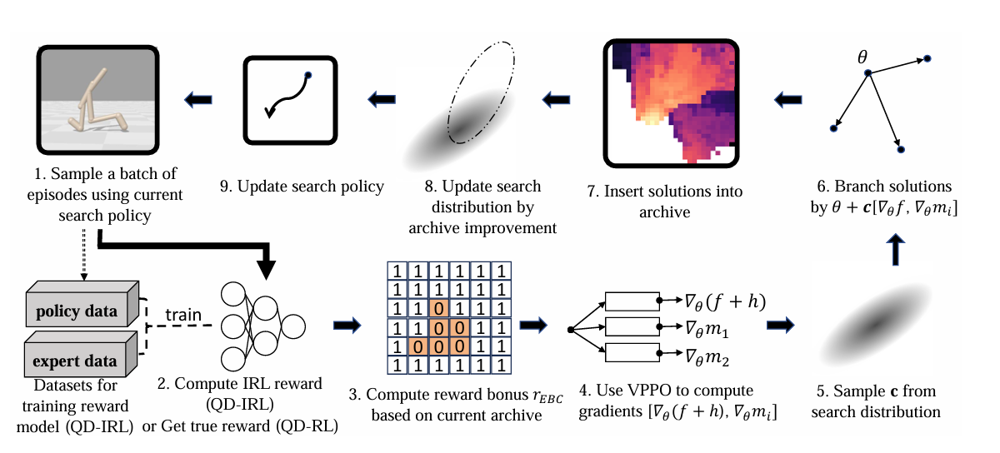

# ***ICML 2025***: Diversifying Robot Locomotion Behaviors with Extrinsic Behavioral Curiosity


*Zhenglin Wan, Xingrui Yu, David Mark Bossens, Yueming Lyu, Qing Guo, Flint Xiaofeng Fan, Yew-Soon Ong, Ivor W. Tsang* 

             Centre for Frontier AI Research (CFAR), A*STAR, Singapore

<h1 align="center"> 
    
</h1>

## 1. Short Introduction
Extrinsic Behavior Curiosity (EBC) mechanism is a technique which enables the robot to learn a broad range of high-performing and **behavioral-diverse** policies via Quality Diversity (QD) Optimization. EBC could be seamlessly integrated into **any** Reinforcement Learning (RL) and Inverse Reinforcement Learning (IRL) algorithm, providing a generic techniques to enhance robot learning in terms of diversity. This repository contains the implementation of EBC and its QD base algorithm. 


## 2. Quick Start

### 2.0 Clone the repository.
Run below command in your terminal:

```
git clone https://github.com/vanzll/EBC.git
cd EBC
```

### 2.1 Installing key packages.
Firstly, run below command to obtain basic packages required:
```python
conda env create -f ebc.yml
conda activate ebc
pip install -e pyribs/
```
Then install the specific version of jaxlib with CUDA support:

```
# for CUDA 11 and cuDNN 8.2 or newer
wget https://storage.googleapis.com/jax-releases/cuda11/jaxlib-0.3.25+cuda11.cudnn82-cp39-cp39-manylinux2014_x86_64.whl
pip install jaxlib-0.3.25+cuda11.cudnn82-cp39-cp39-manylinux2014_x86_64.whl

# OR 

# for CUDA 11 and cuDNN 8.0.5 or newer 
wget https://storage.googleapis.com/jax-releases/cuda11/jaxlib-0.3.25+cuda11.cudnn805-cp39-cp39-manylinux2014_x86_64.whl
pip install jaxlib-0.3.25+cuda11.cudnn805-cp39-cp39-manylinux2014_x86_64.whl
```


### 2.2 Reproduce the results.
We provided runner files for your convenience to reproduce the results.

- QD-IRL:
```python 
source runners/local/train_il_ebc_halfcheetah.sh
source runners/local/train_il_ebc_humanoid.sh
source runners/local/train_il_ebc_walker2d.sh
```

- QD-RL
```python 
source runners/local/train_rl_ebc_humanoid.sh
```
Inside the runner file, there are three lines that you should modify to get access to results with different settings:
- 1. SEED: run the experients with multiple random seeds to justify the results.
- 2. intrinsic_module (for IL methods): gail, vail or diffail, corresponding to three base IL methods in the paper.
- 3. archive_bonus: true or false, corresponding to EBC-improved version or baseline version of IL methods.

## 3. Results.

### 3.1 Quantative results.

| Method              | Halfcheetah QD-Score      | Walker2d QD-Score        | Humanoid QD-Score        |
|---------------------|--------------------------|--------------------------|--------------------------|
| GAIL-EBC (Ours)     | 2.64 × 10⁶ ± 9.21 × 10⁴  | 3.42 × 10⁶ ± 1.36 × 10⁵  | 5.31 × 10⁶ ± 5.78 × 10⁵  |
| GAIL                | 2.02 × 10⁶ ± 8.36 × 10⁵  | 2.47 × 10⁶ ± 2.88 × 10⁵  | 1.86 × 10⁶ ± 4.51 × 10⁵  |
| VAIL-EBC (Ours)     | 3.78 × 10⁶ ± 7.69 × 10⁴  | 3.19 × 10⁶ ± 2.15 × 10⁵  | 7.26 × 10⁶ ± 3.10 × 10⁵  |
| VAIL                | 3.62 × 10⁶ ± 4.00 × 10⁴  | 2.40 × 10⁶ ± 2.13 × 10⁵  | 5.09 × 10⁶ ± 6.86 × 10⁵  |
| DiffAIL-EBC (Ours)  | 3.99 × 10⁶ ± 3.11 × 10⁵  | 2.93 × 10⁶ ± 7.59 × 10⁴  | 8.92 × 10⁶ ± 6.60 × 10⁵  |
| DiffAIL             | 4.02 × 10⁶ ± 5.82 × 10⁴  | 1.71 × 10⁶ ± 4.08 × 10⁵  | 3.56 × 10⁶ ± 3.71 × 10⁵  |

### 3.2 Figures.

The figure below shows the performance comparison of all four metrics across three environments.


## 4. Acknowledgements.
- The GPU-accelerated rigid body simulator is adapted from [Brax](https://github.com/google/brax).
- The key contribution of our work is built on QD library [pyribs](https://github.com/icaros-usc/pyribs).
- The vectorized RL training pipeline of this repository is inspired by [PPGA](https://arxiv.org/abs/2305.13795) paper.
- The RL, IL algorithms of this repository are partly adapted from [cleanrl](https://github.com/vwxyzjn/cleanrl).

## 5. Bibtex.
If you found our work helpful, please consider to cite our work via:

```
@misc{wan2025diversifyingrobotlocomotionbehaviors,
      title={Diversifying Robot Locomotion Behaviors with Extrinsic Behavioral Curiosity}, 
      author={Zhenglin Wan and Xingrui Yu and David Mark Bossens and Yueming Lyu and Qing Guo and Flint Xiaofeng Fan and Yew Soon Ong and Ivor Tsang},
      year={2025},
      eprint={2410.06151},
      archivePrefix={arXiv},
      primaryClass={cs.LG},
      url={https://arxiv.org/abs/2410.06151}, 
}
```
